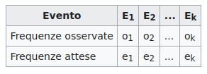
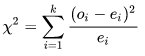

La statistica 𝛘²
================

Test di ipotesi
~~~~~~~~~~~~~~~

Con *test chi quadrato "χ²"*, si intende uno dei test di :doc:`/statistiche/inferente`
di :guilabel:`verifica d'ipotesi` che utilizzano la distribuzione chi quadrato per decidere se rifiutare 
o non rifiutare l'ipotesi nulla. A seconda degli assunti di partenza usati 
tali test vengono considerati parametrici o non parametrici.

Il test chi quadrato è ampiamente utilizzato per verificare che le frequenze dei valori 
osservati si adattino alle frequenze teoriche di una distribuzione di probabilità prefissata. 

Un primo esempio
~~~~~~~~~~~~~~~~

Per esempio, è noto che il risultato di 100 lanci di una moneta segue la distribuzione
uniforme ed è difficile ottenere un risultato che si discosti sensibilmente dall'ottenere 
50 teste e 50 croci. 
Il test chi quadrato consente di stabilire, dopo aver fissato l'errore massimo tollerato, 
se le discrepanze tra le frequenze osservate e quelle teoriche sono imputabili completamente 
al caso o se invece è lecito supporre che la moneta sia truccata.

Un esempio tratto dal sondaggio
~~~~~~~~~~~~~~~~~~~~~~~~~~~~~~~

Consideriamo la domanda D7 :doc:`/statistiche/descrittive/anagrafiche/eta` e la domanda D9
:doc:`/statistiche/descrittive/comportamentali/mostra/tempo`.
Se le due variabili non fossero correlate :guilabel:`l'ipotesi nulla`, allora le frequenze relative
della variabile *età*, per ogni valore/risposta alla domanda *tempo visita*
sarebbero simili, a quelle considerando la variabie da sola. Per esempio, la percentuale dei giovani, meno di 18 anni, che 
dedica meno di 30 minuti di tempo alla visita, rispetto a quella dei totale dei giovani, dovrebbe essere simile a quella dei giovani sul totale.
Ma la percentuale di giovani sul totale è del 4,63%, mentre la percentuale dei giovani che dedicano meno di 30 minuti di tempo alla visita
sul totale dei giovani è del 76,92%. Una significativa, quanto significativa lo stabilisce il test, percentuale di giovani fa visite brevi.
Le due variabili sono correlate.

Definizione
~~~~~~~~~~~

Supponiamo che in un particolare campione si sia osservato che un insieme 
di possibili eventi E1, E2, …, Ek si presenta con frequenze o1, o2, …, ok (dette frequenze osservate). 
Supponiamo poi che, secondo le regole della probabilità, ci si attenda un secondo insieme di possibili
eventi con frequenze e1, e2, …, ek (dette frequenze teoriche o attese), ossia, riassumendo:

La variabile test χ² si ottiene sommando, per ogni evento Ei il quadrato degli scarti 
tra le frequenze teoriche e quelle osservate, pesato sulle frequenze teoriche:

Così, se il numero totale di eventi k è fissato, si distribuisce come una variabile χ² 
con k-1 gradi di libertà. Altrimenti, se k è una variabile a sua volta aleatoria, ad esempio Poissoniana
(come può essere in un esperimento di conteggio), si distribuisce come una variabile χ² 
con k gradi di libertà.

Se le frequenze osservate coincidono esattamente con quelle teoriche, allora χ² = 0, 
mentre se esse differiscono, χ² > 0. Più grande è il valore di χ², più grande è la discrepanza 
tra le frequenze osservate e quelle teoriche.

