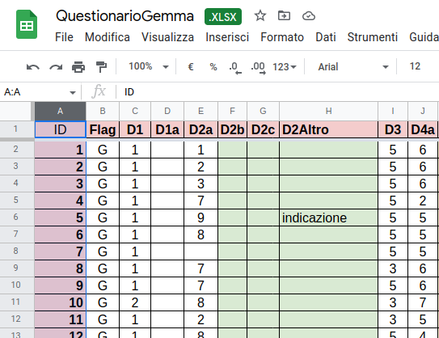

Dati
====

I dati raccolti sono `qui <https://docs.google.com/spreadsheets/d/e/2PACX-1vSe8__fQMlVJUIHbq0ZhmFRRKPciwpyn2143rwuVfQLAunZxw1JnAweUB9_j2xhPNGCDyLnZ9GOcQh6/pub?gid=0&single=true&output=csv/>`_

Sono organizzati in forma matriciale: 
una tabella con una riga per ogni questionario compilato e una colonna per ogni domanda.
All'incrocio si trova la risposta codificata data nel questionario/riga per la domanda/colonna.

