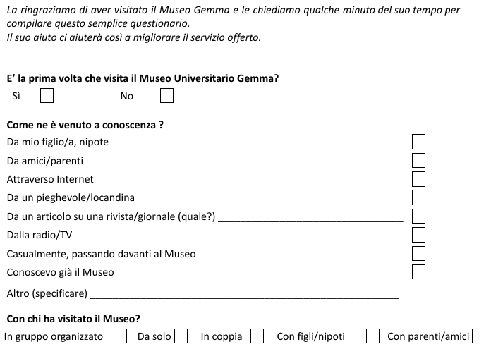
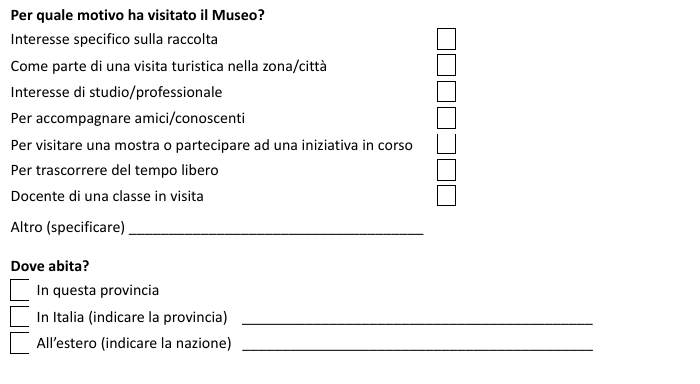
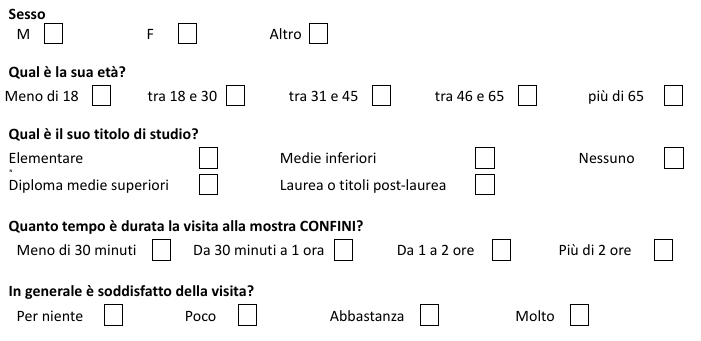
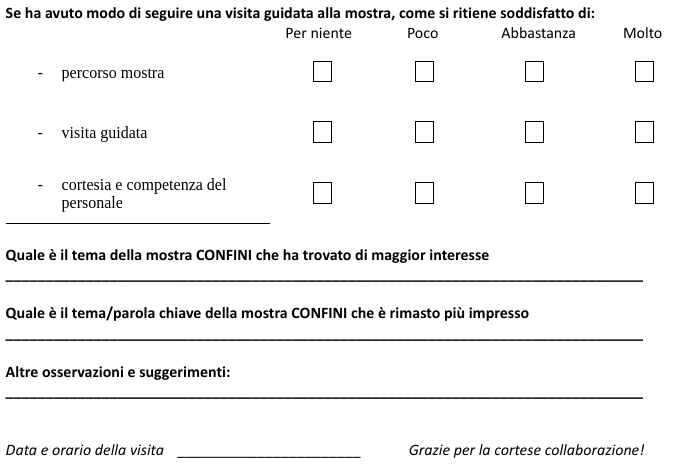
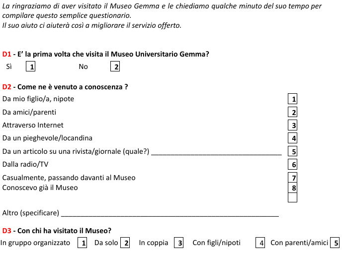
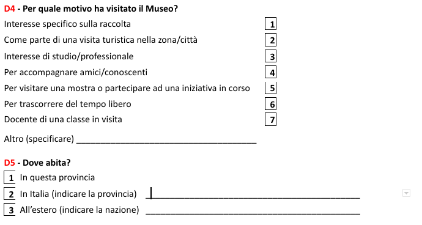
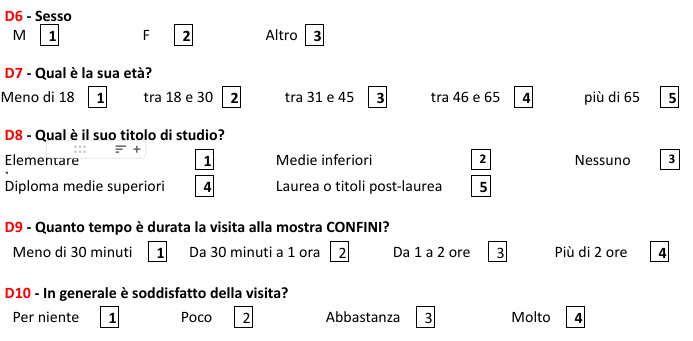
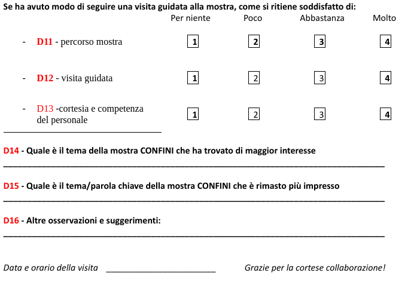

Questionario
============
Il questionario originale è questo:

Ma, per permetterne un trattamento statistico computazionale, sia le domande che le risposta sono state tutte codificate.
Il codice della domanda ha la forma *D1...Dn*. Le risposte ricevono un codice numerico a partire da 1.
Quindi, il questionario a cui si fa riferimento in seguito assume questa forma.

