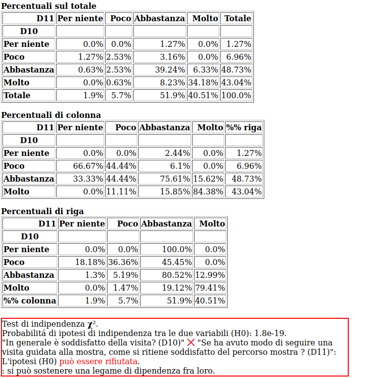
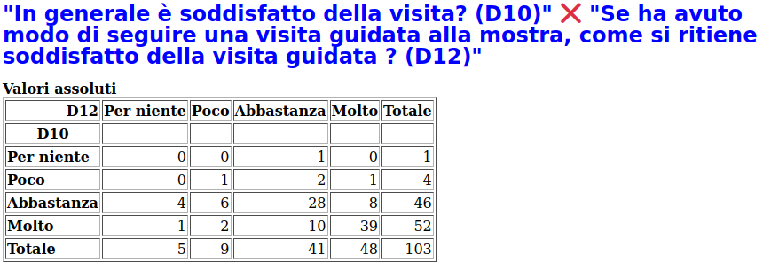
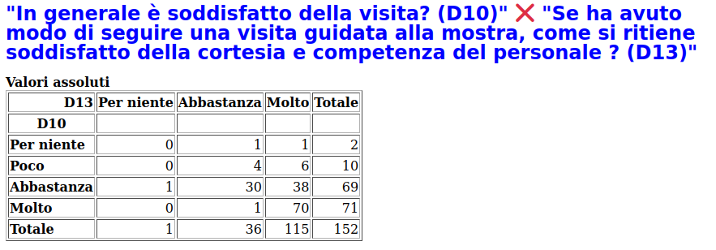

Comportamentali
===============

La correlazione tra la domanda D10 :doc:`"è soddisfatto della visita?" </statistiche/descrittive/comportamentali/soddisfatto>` 
e la domanda D11 :doc:`"si ritiene soddisfatto del percorso mostra? </statistiche/descrittive/comportamentali/mostra/soddisfatto-percorso>` 
è stretta. Allo domanda D10 sulla visita
rispondono *molto* e *abbastanza* rispettivamente il 43% e il 48%.

Alla stessa domanda, in D11:
  - *molto*: 40%, 
  - *abbastanza*: 51%, 

.. note::

  Chi ha apprezzato la visita, abbastanza o molto, è stato parimenti soddisfatto del percorso della mostra
  
.. image:: images/d10_d11_1.png
  :width: 500

La correlazione tra la domanda D10 :doc:`"è soddisfatto della visita?" </statistiche/descrittive/comportamentali/soddisfatto>` 
e la domanda D12 :doc:`"si ritiene soddisfatto della visita guidata? </statistiche/descrittive/comportamentali/mostra/soddisfatto-visita>` 
è evidente. Allo domanda D10 sulla visita
rispondono *molto* e *abbastanza* rispettivamente il 44% e il 50%.

Alla stessa domanda, in D12:
  - *molto*: 46%, 
  - *abbastanza*: 39%, 

.. note::

  In generale, chi ha apprezzato la visita al Museo, abbastanza o molto, è stato parimenti soddisfatto della visita guidata alla mostra. 
  sebbene con un lieve minore gradimento

.. image:: images/d10_d12_2.png
  :width: 500

La correlazione tra la domanda D10 :doc:`"è soddisfatto della visita?" </statistiche/descrittive/comportamentali/soddisfatto>` 
e la domanda D13 :doc:`"si ritiene soddisfatto della cortesia e competenza del personale? </statistiche/descrittive/comportamentali/mostra/soddisfatto-personale>` 
è forte. Coloro che hanno apprezzato la visita sono stati soddisfatti del personale per il 99%. 

.. note::

  Coloro che hanno apprezzato la visita sono stati soddisfatti del personale per il 99%.
  Nessuno ha gradito poco o per niente insieme sia la visita che il personale.

La correlazione tra la domanda D11 :doc:`"si ritiene soddisfatto del percorso mostra? </statistiche/descrittive/comportamentali/mostra/soddisfatto-percorso>` 
e la domanda D12 :doc:`"si ritiene soddisfatto della visita guidata? </statistiche/descrittive/comportamentali/mostra/soddisfatto-visita>`
è forte.

Allo domanda D11 rispondono *molto* e *abbastanza* rispettivamente il 48% e il 43%.

Alla stessa domanda, in D12:
  - *molto*: 47%, 
  - *abbastanza*: 39%, 

.. note::

  Il percorso della mostra e la visita guidata hanno ottenuto lo stesso gradimento.

.. image:: images/d11_d12_1.png
  :width: 500

.. image:: images/d11_d12_2.png
  :width: 500

La correlazione tra la domanda D11 :doc:`"si ritiene soddisfatto del percorso mostra? </statistiche/descrittive/comportamentali/mostra/soddisfatto-percorso>` 
e la domanda D13 :doc:`"si ritiene soddisfatto della cortesia e competenza del personale? </statistiche/descrittive/comportamentali/mostra/soddisfatto-personale>` 
è evidente.

Allo domanda D11 rispondono *molto* e *abbastanza* rispettivamente il 42% e il 49%.

Alla stessa domanda, in D13:
  - *molto*: 75%, 
  - *abbastanza*: 23%, 

.. note::

  La cortesia e la competenza del personale sono state molto apprezzate.
  Anche piú di altri aspetti della mostra.

.. image:: images/d11_d13_2.png
  :width: 500

La correlazione tra la domanda D12 :doc:`"si ritiene soddisfatto della visita guidata? </statistiche/descrittive/comportamentali/mostra/soddisfatto-visita>` 
e la domanda D13 :doc:`"si ritiene soddisfatto della cortesia e competenza del personale? </statistiche/descrittive/comportamentali/mostra/soddisfatto-personale>`
è forte.

Allo domanda D12 rispondono *molto* e *abbastanza* rispettivamente il 39% e il 48%.

Alla stessa domanda, in D13:
  - *molto*: 76%, 
  - *abbastanza*: 22%, 

.. note::

  La cortesia e la competenza del personale sono state molto apprezzate.
  Anche piú di altri aspetti della mostra.

