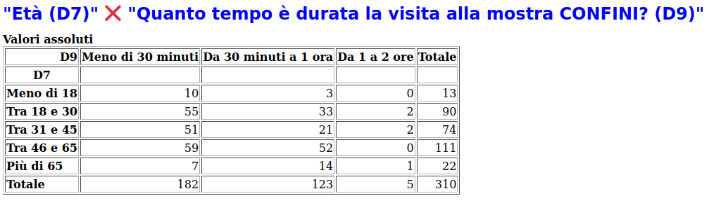
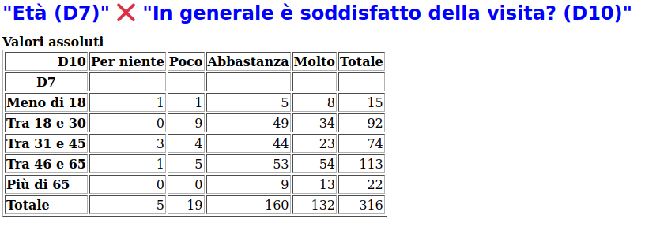
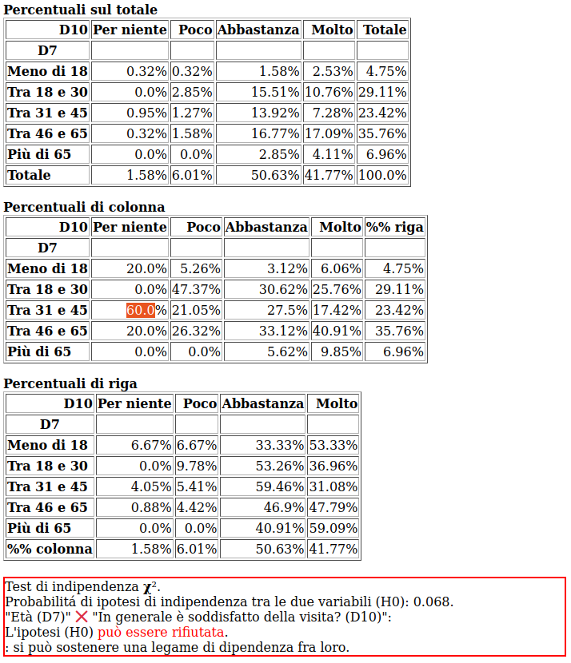
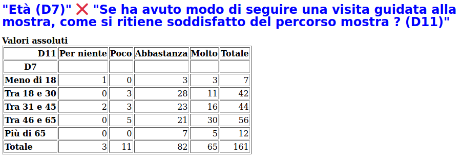
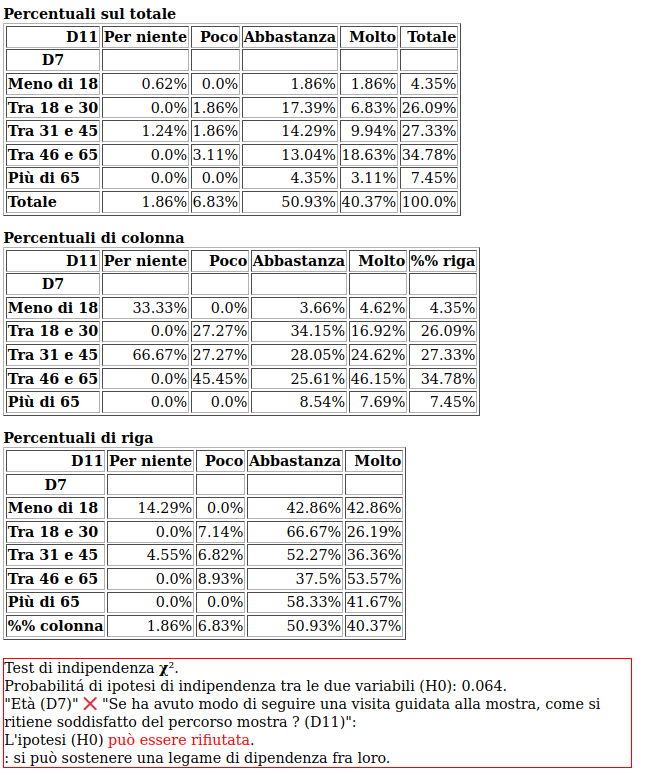
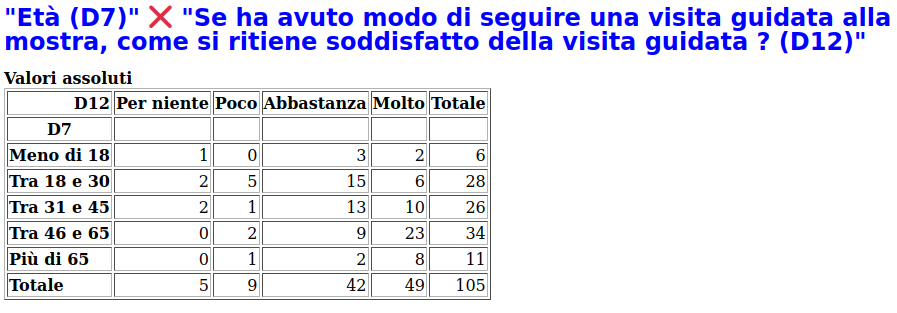
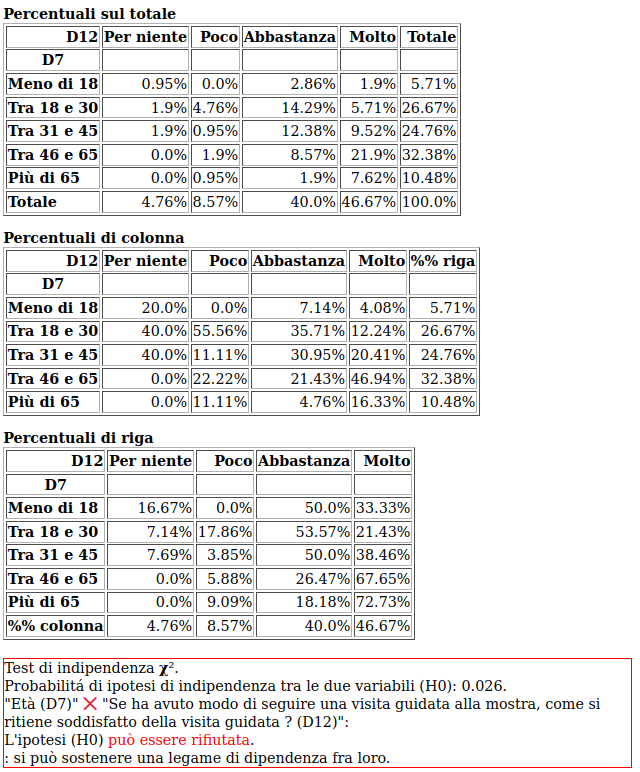

Età
===

Nella statistica descrittiva per 
:doc:`età </statistiche/descrittive/anagrafiche/eta>`, i giovani sono intorno al 5%, coloro
che hanno oltre 65 anni il 7% e la classe maggiormente rappresentata, il 35%, è quella dai 46 ai 65 anni.

La divesa età del visitatore si riflette sulla modalità di vista, nel senso della domanda D3 
:doc:`Con chi...? </statistiche/descrittive/comportamentali/con-chi>`:
  - **i due terzi dei visitatori sotto i 18 e il 50% di quelli tra 18 e 30 anni hanno fatto la visita con parenti/amici**
  - **il 50% dei maggiori di 65 anni ha visitato la mostra in coppia**.

.. note::

  In generale, una correlazione tra modalità di visita "con chi" e età esiste, ma è spiegabile
  nei termini dei cambiamenti dei rapporti sociali in funzione dell'età. I giovani fanno esperienze con amici
  mentre i piú anziani con la famiglia (coppia). Da notare che la percentuale di chi è venuto da solo
  non sembra correlata con l'età : intorno al 17%.

.. image:: images/eta_d3_1.png
  :width: 500

.. image:: images/eta_d3_2.png
  :width: 500

Anche la correlazione tra :doc:`età </statistiche/descrittive/anagrafiche/eta>` e la domanda D8
:doc:`titolo di studio </statistiche/descrittive/anagrafiche/titolo>` esiste ma è spiegabile
da quando, nella vita di una persona, si affrontano i diversi livelli scolastici 
(medie, superiori, università). 

.. note::

  I giovani (meno di 18 anni) non sono laureati. La percentuale di laureati è massima (80%) 
  nella classe tra 31-45 anni, e si mantiene di molto al disopra (60%) della percentuale 
  del 20% della popolazione italiana (di 25-64 anni). 

.. image:: images/eta_d8_1.png
  :width: 500

.. image:: images/eta_d8_2.png
  :width: 500

La durata della visita :doc:`domanda D9 </statistiche/descrittive/comportamentali/mostra/tempo>` risulta
significativamente correlata con l'età. 
  - il 60% dei visitatori con meno di 30 anni dichiara di aver impiegato meno di 30 minuti, contro il 30% di coloro che hanno piú di 65 anni
  - il 60% dei visitatori con piú di 65 anni dichiara di aver impiegato da 30 minuti a un ora, contro il 30% di coloro che hanno meno di 30 anni

.. note::

  In generale il tempo dedicato alla visita cresce all'aumentare dell'età. I giovani vi dedicano meno tempo
  dei piú anziani.

.. image:: images/eta_d9_2.png
  :width: 500

La correlazione tra età e livello di soddisfazione della visita alla mostra :doc:`domanda D10 </statistiche/descrittive/comportamentali/mostra/soddisfatto-visita>`
si caratterizza per: 
  - il 60% dei visitatori con piú di 65 anni è molto soddisfatto, il 50% abbastanza, messuno non lo è
  - tra i 18 e i 45 anni, i molto soddisfatti sono tra il 30% e il 40%, il 9% per niente o poco.

.. note::

  In generale il gradimento della mostra cresce all'aumentare dell'età. I giovani sono meno soddisfatti
  dei piú anziani.

La correlazione tra età e livello di soddisfazione del percorso della mostra :doc:`domanda D11 </statistiche/descrittive/comportamentali/mostra/soddisfatto-visita>`
è analogo a quella precedente, ma in generale con un livello inferiore: 
  - il 40% dei visitatori con piú di 65 anni è molto soddisfatto, il 60% abbastanza, messuno non lo è
  - tra i 18 e i 45 anni, i molto soddisfatti sono tra il 20% e il 30%, il 7% per niente o poco.

.. note::

  In generale il gradimento del percorso della mostra cresce all'aumentare dell'età. I giovani sono meno soddisfatti
  dei piú anziani.

La correlazione tra età e livello di soddisfazione della visita guidata alla mostra :doc:`domanda D12 </statistiche/descrittive/comportamentali/mostra/soddisfatto-visita>`
è analogo a quelli precedente, ma con una piú marcata differenziazione per età: 
  - il 72% dei visitatori con piú di 65 anni è molto soddisfatto contro il 20%-30% rispettivamente dei minori di 18 anni e dei sitatori da 18 a 30

.. note::

  In generale il gradimento del percorso della mostra cresce grandemente all'aumentare dell'età. I giovani sono molto meno soddisfatti
  dei piú anziani.

