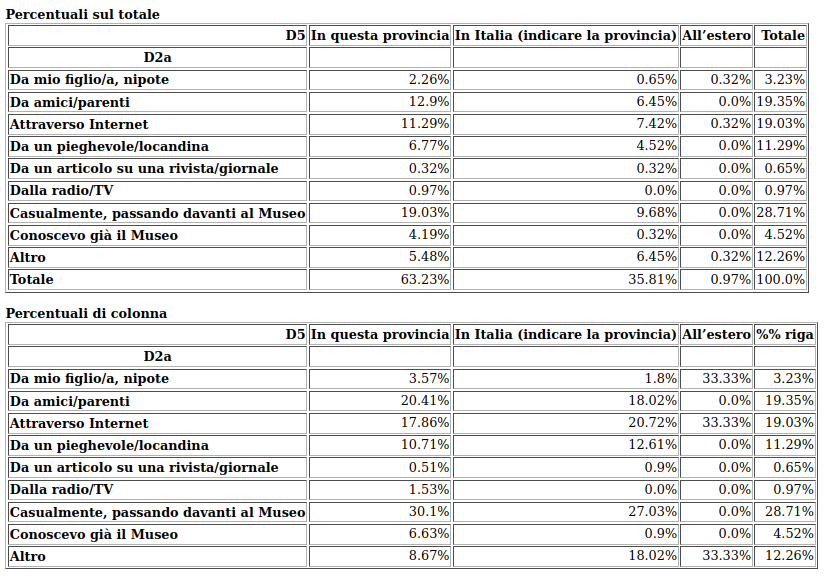

Residenza
==========

La correlazione tra la domanda D5 :doc:`"dove abita?" </statistiche/descrittive/anagrafiche/abita>` e la domanda D5
:doc:`"Come ne è venuto a conoscenza?"" titolo di studio </statistiche/descrittive/comportamentali/come-conosce>` dipende
in larga misura dalla maggior conoscenza dell'esistenza del museo che i residenti nella provincia di Modena
hanno rispetto ai non residenti. 

.. image:: images/residenza_d2_1.png
  :width: 500

Tra la domanda D5 :doc:`"dove abita?" </statistiche/descrittive/anagrafiche/abita>` e livello di soddisfazione della visita alla mostra :doc:`domanda D10 </statistiche/descrittive/comportamentali/mostra/soddisfatto-visita>`
c'è una correlazione:

  - il 45% dei visitatori residenti in provincia  si dichiara molto soddisfatto contro il 32% di chi vive fuori in Italia
  - il 5% dei visitatori residenti in provincia  si dichiara poco o per nulla soddisfatto contro il 10% di chi vive fuori in Italia

.. note::

  I residenti in provincia sono piú soddisfatti della visita alla mostra dei non residenti. 

.. image:: images/residenza_d10_2.png
  :width: 500

Tra la domanda D5 :doc:`"dove abita?" </statistiche/descrittive/anagrafiche/abita>` e livello di soddisfazione del percorso della mostra :doc:`domanda D11 </statistiche/descrittive/comportamentali/mostra/soddisfatto-visita>`
c'è una correlazione:

  - il 45% dei visitatori residenti in provincia  si dichiara molto soddisfatto contro il 24% di chi vive fuori in Italia
  - il 15% dei visitatori residenti in provincia  si dichiara poco o per nulla soddisfatto contro il 4% di chi vive fuori in Italia

.. note::

  I residenti in provincia sono piú soddisfatti del percorso della mostra dei non residenti. 

