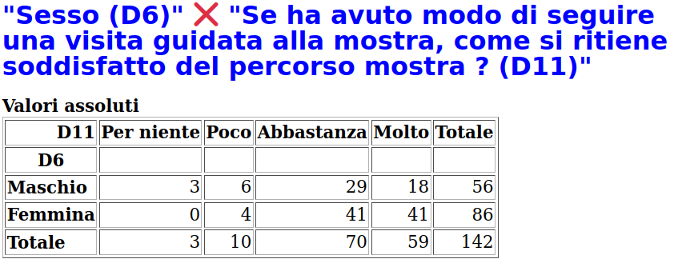

Sesso
=====

Nella statistica descrittiva per 
:doc:`sesso </statistiche/descrittive/anagrafiche/sesso>` le femmine sono il 40% e i maschi il 60%
(escludendo le mancate risposte). Allo domanda sulla :doc:`D11 - soddisfazione del percorso della mostra </statistiche/descrittive/comportamentali/mostra/soddisfatto-percorso>`
rispondono *molto* e *abbastanza* rispettivamente il 20% e il 25%.

Alla stessa domanda D11:
  - *molto*: **30% uomini contro un 70% donne**, 
  - *per nulla*: **100% uomini**, 
  - *poco* : **60% uomini, 40% donne** 

.. note::

  Se ne conclude che la soddisfazione per il percorso guidato della mostra è stata minore 
  negli uomini mentre le donne hanno dato un giudizio maggiormente positivo 

