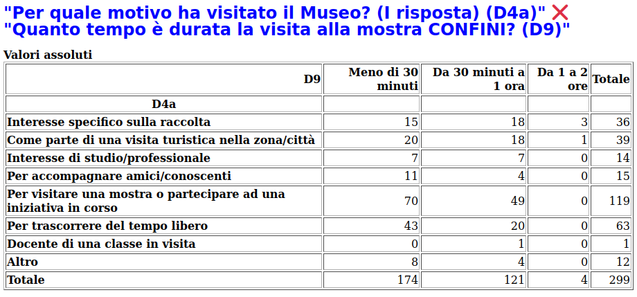
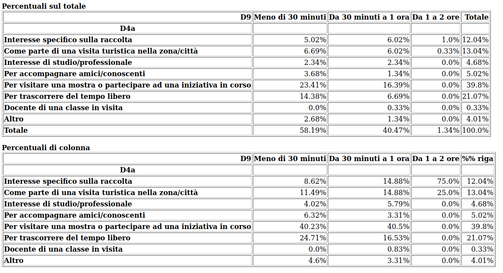
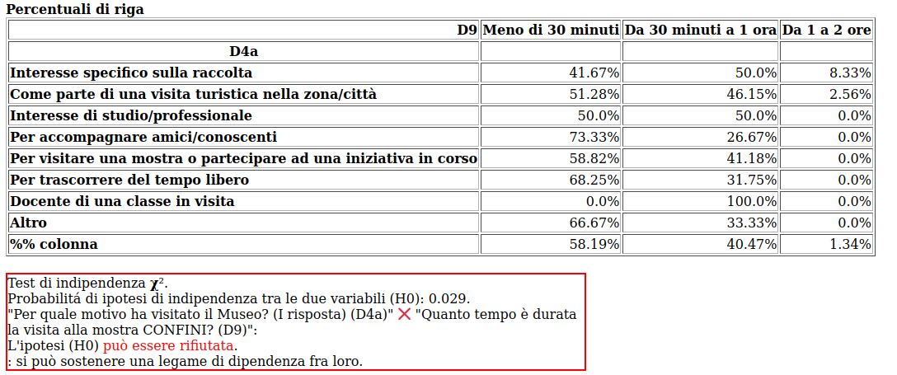
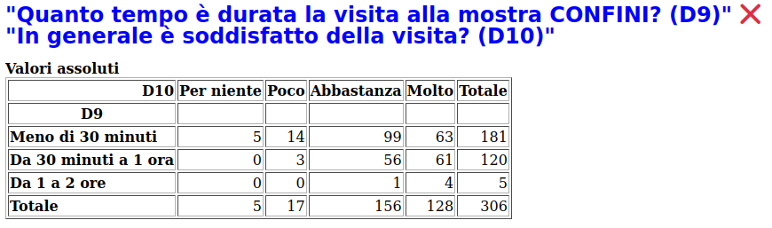
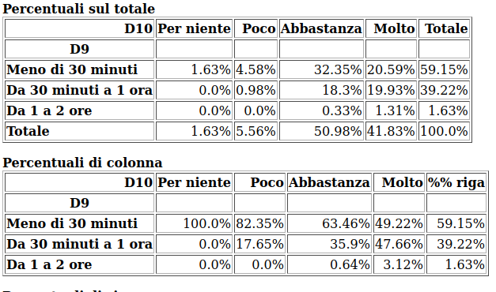
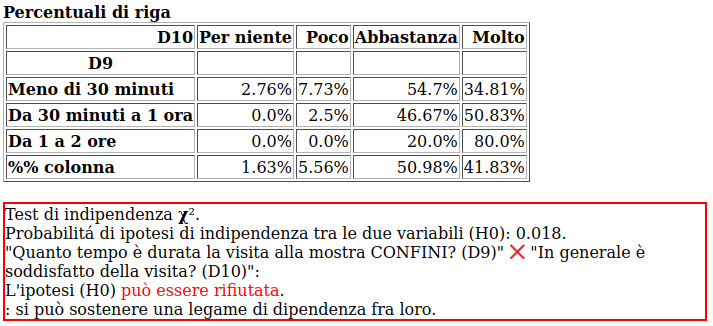

Tempo della visita
==================

La correlazione tra la domanda D9 :doc:`"Tempo di durata della visita alla mostra?" </statistiche/descrittive/comportamentali/mostra/tempo>` 
e la domanda D4 :doc:`"Per quale motivo ha visitato il Museo?" </statistiche/descrittive/comportamentali/motivo-visita>` 
è  spiegata ampiamente dal comportamento di coloro che visitano la mostra per trascorrere del tempo libero
o per accompagnare amici. In entrambi i casi si preferisce significativamente di piú fare una vsita di minor durata.

Complessivamente, ovvero senza distinguere in base alle motivazioni,
il tempo della visita è **meno di 30 minuti per il 58% e oltre per il 40%**.
Ma, distinguendo:

  - Per accompagnare amici/conoscenti: **meno di 30 minuti: 73%, oltre: 26%**
  - Per trascorrere del tempo libero: **meno di 30 minuti: 68%, oltre: 32%**

.. note::

  Se ne conclude che coloro che non hanno ragioni specifica per visitare la mostra, 
  tendono a fare visite piú  brevi.
  

La correlazione tra la domanda D9 :doc:`"Tempo di durata della visita alla mostra?" </statistiche/descrittive/comportamentali/mostra/tempo>` 
e la domanda D10 :doc:`"In generale è soddisfatto della visita?" </statistiche/descrittive/comportamentali/mostra/tempo>` 
è spiegata dal dato relativo a coloro che sono stati poco o per nulla soddisfatti : 11% ma che hanno prevalentemente
preferito una visita breve (meno di 30 minuti). 

.. note::

  Una visita piú breve lascia piú insoddisfatti.

