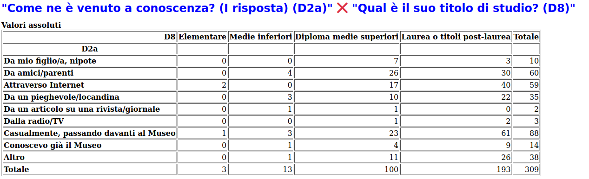
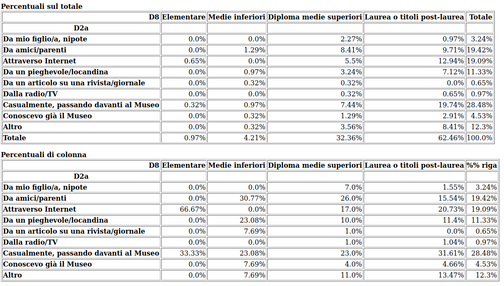
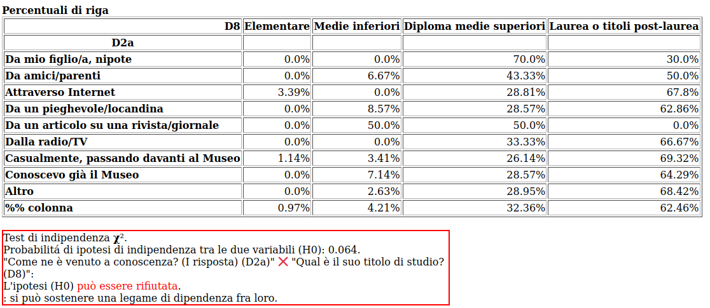

Titolo di studio
================

La correlazione tra la domanda D2 :doc:`Come è venuto a conoscenza? </statistiche/descrittive/comportamentali/come-conosce>` e la domanda D8
:doc:`titolo di studio </statistiche/descrittive/anagrafiche/titolo>` esiste ma non ha una spiegazione chiaramente
evidente. 

.. note::

  Per i non laureati conta maggiormente la comunicazione da amici e parenti (30%) rispetto ai laureati (15%)

